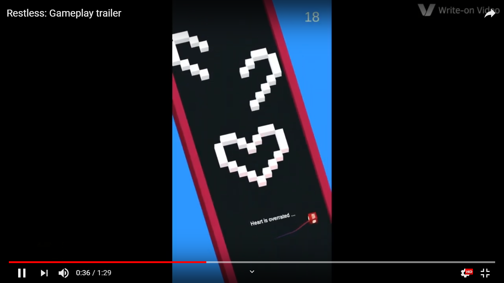

# Restless
A physics based rhythm game about restlessness. (kind of)
This game is inspired from more famous android games like Duet and SineLine.

You can check out the game play trailer here: 

Here is a link to a reddit post I made when I released the game on playstore:
[r/AndroidGaming](https://www.reddit.com/r/AndroidGaming/comments/c6yfk1/dev_restless_i_developed_this_game_as_a_hobby/)

Here is a link to the playstore if you want to download the game:
[Restless (google playstore)](https://play.google.com/store/apps/details?id=com.HardikPrajapati.Restless)

# Credits

## Sounds and Music

Most of the sound effects and music were obtained from https://opengameart.org/

- Background music - https://opengameart.org/content/breathing
- Background music nature - https://opengameart.org/content/outdoor-ambiance
- Sound effects
  - pick up - https://opengameart.org/content/picked-coin-echo
  - power up transition - https://opengameart.org/content/windy-sound-1

## Unity Assest

- Android Native Audio - https://assetstore.unity.com/packages/tools/audio/android-native-audio-35295
